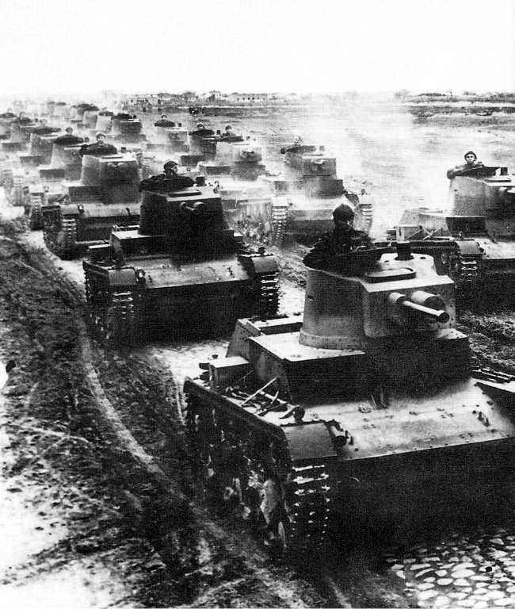

An excessively detailed simulation of the economy in Hearts of Iron 4
=====================================================================
This project has primarily been created as a Java training project.

The aim is to accurately simulate the economy, and industry in the real-time grand strategy game Hearts of Iron 4, in particular, the aim is to simulate a game as Poland, from the games starting on the 1st of January 1936, and be ready to fight a defensive war with Nazi Germany on the 14th of September 1938: A year earlier than historically.

This learning project involves the following points:

* A large Java project in IntelliJ with several packages, classes, records, enums, and with error-handling.
* Working with dates and times in Java using the Calendar utility
* Working with Jframes and windows
* Extensive loading of data from JSON files using the Jackson library.
* The organization, generation and display of data in the terminal, and in graphs using the jfree.chart package.

Historical background, and alt-historical changes
-------------------------------------------------
Historically, buoyed by the Anschluss of Austria, Adolf Hitler's demanded to annex the "Sudetenland" region of Czechoslovakia. Though the Czechs were allied to the French, Prime ministers Neville Chamberlain of the UK, and Édouard Daladier agreed with Mussolini and Hitler to pressure the Czechs to hand over the contested region without a fight.

Setting the state for the complete annexation of Czechoslovakia, and the joint Nazi-Soviet invasion of Poland 1 year later.

In the game, there is however an alternative: If Walery Sławek wins the power struggle after the death of the nation founder turned dictator Josef Pilsudski, Poland can restore democracy and ally with Czechoslovakia, Estonia, Latvia and Lithuania before the Munich conference, and fight Hitler already in 1938. (And Stalin 1 year later, when he invades the Baltics)

Mechanical background, Factories in Hearts of Iron 4 works
-----------------------------
The economy in the game follows very simple rules since the focus of the game is on fighting the war, but even simple rules can be quite complex.

Every nation has a number of "states", these states contains buildings and resources (and people, but that is not important in my simulation). The most important type of building is factories, which can be either Civilian factories (called "Civs" by most players), Military factories (or just "mils"), and Refineries

* Civilian factories are used to build other buildings
    - Buildings cost CIC (Civilian Industrial Capacity) to build 
    - Civilian factories produce 5 CIC per day, which can be used to build buildings, this is increased by 20% pts per level "Infrastructure" in the target state
    - Infrastructure is another building which can be built
    - A number of Civs, proportional to the nation's total factories are required for "consumer goods", and do not produce CIC
    - Civs can also be traded for 8 resources, in which case they don't produce
* Military factories are used to build military equipment
    - Military factories produce $4.5\times E\times (1+F) (1-R)$ MIC (Military industrial capacity) each day
    - The efficiency $E$ is a number between 0 and the efficiency cap $E_{cap}<1.0$, and where $dE/dt=0.001 E_{cap}^2/E$ every day (So efficiency grows slowly until it reaches the Efficiency cap)
    - The factories which exist on day 0 can freely be assigned to infantry equipment or support-equipment and start with $E=E_{cap}=0.5$; all new factories start with $E=0.1$
    - $F$ is the factory output bonus for the nation
    - Each Military factory uses a number of resources per factory: either Rubber, Steel, Tungsten, and Chromium (which really represents many rare metals such as Chromium and Nickel), the exact number depends on the type of equipment.
    - For every resource deficit, the resource penalty $R$ grows by 0.05.
    - The MIC is converted to equipment based on its MIC cost, (For example, enough guns to equip one infantry squad costs 0.5 MIC, and a single light tank costs 6 MIC)
    - The program will produce a plot of production efficiency $E$, Factory output bonus $F$, and resource multiplier ($1-R$)
    - Total production is proportional to the area under the efficiency curve
    - Efficiency growth means older factories are extremely valuable

* Refineries do not produce points but add synthetic rubber to the states
  - It is not as cost-effective as buying rubber on the free market
* Infrastructure boosts construction speed and gives a 20% boost to local resources
    - The construction speed bonus is generally not worth the investment
    - The resource boost is very valuable in states like Katowice.
* Another type of factory is the naval dockyard, which builds ships
  - Since I am going to focus on Poland, which has a land border with Germany, I will not simulate these

Mechanical background, Stats, "Focuses" and Plan G
------------
Everything is affected by dozens of stats: such as factory output bonuses, construction speed bonuses, and more, which in turn are affected by political stability, which depends on the popularity of the four great ideologies: Democracy, Fascism, Communism, and non-aligned (which is a miscellaneous category including monarchy, oligarchy, and Finland).

Here is how politics in Poland changed over time, from 1936 to 1938:

Truth be told, this is the least accurate part of my simulation, as the mechanics governing ideological drifts are poorly explained in-game, and on the official Wiki

The player can control these stats by researching new technologies, taking "decisions" (often trading one stat for another), and completing one political "focus" each 35 or 70 days and can give stats or instantly create buildings.

A true simulation would include all these things: include the ability to research in different order, and the ability to choose which focus to take.

I have decided not to do this, instead, my simulation loads "events" from a JSON file, and based on these events, modify stats or state buildings on certain days. After replaying the start a dozen or so times, I have created "PlanG38.json" which records all the focuses, research, and decisions in what I believe is optimal order. 

I have even tried to make some sort of in-universe narrative explanation of the events, explaining how Walery Sławek (who historically lost the power struggle to Ignacy Mościcki and Edward Rydz-Śmigły and died in 1939), regained the role as prime-minister, restored democracy, and formed and an alliance of minor states against the Nazis.

How the program works: Setting up the simulation
------------------------------------------------
The program loads all information from the nation folder (the first argument, by default `Poland`), and an event Script (the second argument, default `Plan38G.json`).

The nation folder must contain: a file `Properties.json`, where all starting properties of the nation must be defined (look at the Javadocs in the class `NationalProperties.java` to see which exist).

The nation folder also contains: a file `Equipment.json`, where all the possible Equipment is declared (again look at the Javadocs for the class `Equipment.java`). For future work, it is possible to declare future versions of equipment, but in practice that is not taken into account by the simulation

Another required file is `States.json` which contain the list of all states in the nation, (once again, look at the Javadocs in `States.java`).

Finally, the folder should include an event script, this script contains a map of all the events which happen on each day, each event has a name, and a short description, and contain a list with none or more `PropertyEvent` and `StateEvent` which modify the national properties, or the properties of individual states. The state ID is the number in `States.json` the individual state is.

I have provided the event script `PlanG38.json` (it is named so, because it is the 7th (and in my opinion best) attempt), it stores the effects of all the focuses, decisions, and research in Poland, alongside some events with no effects, just for reminding myself what happens.

How the program works: running the program
------------------------------------------
You interact with the game through the terminal, you can run it in IntelliJ, but I recommend you build a jar of it, and run it through the terminal.

You will need a terminal which supports colors, (I recommend Microsoft powershell or any Linux terminal, Linux is generally better at displaying polish letters). When you run the program, you will be told what day it is today, and if you have any decisions to make.

You can view all commands, and all arguments py typing `help`, and you can quit by typing `quit`.

The most important command is `print` which prints the current stats of your nation to the terminal you can add more arguments like `print showStates showFactories showProduction showResources showDecisions` to see ever more intricate stats (especially `showProduction` is more detailed than in-game tooltipes). When you `showDecisions` you can see the id of different decisions.

Write `decide id 4` or just `decide 4` to take the decision with id 4.

Apart from printing, you can show plots of the most important national data with the `show` command (`show save` to save to png), or you can write `showFactories` or `showFactories mil 5` to show plots for all military factories, or just military factory 5.

Finally, you can step ahead in time by writing `step` to step to the next event or decision, or `step days 200` or just `step 200` to step 200 days into the future (although non-optional decisions will interrupt the stepper, and the stepper will refuse to step beyond the last event).

You can also save and load earlier states of the simulation (though these aren't saved to disc!) you can manually create a save, or you can rely on autosaves, created every time the stepper stops (But autosaves only saves past events!).

The goal: building an army for 1938
-----------------------------------
Poland starts with a modest army, with:

* 18400 infantry equipment
* 209 support equipment

Sidenote: The game abstracts away a lot of equipment: "1 infantry equipment" really means guns, bullets, uniforms, boots and helmets for 1 infantry squad, and 1 howitzer also includes ammunition.

The goal of the economic buildup, from 1936 to 1938 is to build an army to win the war.

, Elite mountain infantry supported by tanks, and elite cavalry supported by tanks, the latter two cost the same equipment to make in game, Hoi4 division design is a bit weird and not particularly realistic")

The primary task is to defend the Western border in Silesia, and Pommerania; and around the Exclave of East Prussia in the north.

To defend our borders, I estimate that we need 76 divisions.

The game allows the player to design their divisions however they like, the cheapest infantry division (which still has a chance against the 1938 German army) is the left division in the diagram above and it contains:

* 1010 Infantry equipment costs 505 MIC 
* 30 Support equipment costs 120 MIC    
* 12 Howitzers costs 42 MIC             
* 20 Anti-Aircraft guns costs 80 MIC    
* 10900 Men not build in a factory

Let me be clear, this is very unhistorical, and wouldn't do well in actual combat, as it only has 1 7th the artillery as the Polish division historically had, and it does not have any anti-tank equipment, but this works in Hoi4, where 40mm Bofors anti-air guns somehow function as anti-tank guns.

Or put another way 747 MIC points for a division

Additionally, it would be good to have around 300 trucks (2.5 MIC per truck) and 20 armoured trains (170 MIC per train) to help with logistics. 

However, wars are not won by defending, we need a force of elite infantry or cavalry supported by tanks (the two other divisions in the diagram above). I expect these elite divisions will need the following:

* 1300 Infantry equipment costs 650 MIC
* 120 "7TP" light tanks cost 708 MIC (Becomes available in mid-1937)
* 45 Support equipment costs 180 MIC
* 12 Howitzers costs 42 MIC
* 20 Anti-Aircraft guns costs 80 MIC
* 12400 Men not build in a factory

Again, these divisions are  utterly unhistorical, and would not actually work in WW2 combat. But in game, it is  a decent compromise between quality and cost, and I would like at least 3 to invade German Silesia, preferably 6.

So (roughly twice what Poland actually had at the start of WW2)

Results
-----------
Feel free to look at all the images included in the repository, which show all stats for the nation and all factories in the best example I ran

In the course of running the simulation, I found that the best strategy is to start by building 2 levels of Infrastructure in Katowice (to boost the local steel mines), and then build nothing but military factories, primarily in Katowice and Warzawa (since this is where infrastructure is the highest).

This is also a good idea since we start with a large penalty to civilian and military factory construction speed, which goes away only when the government passes a partial mobilization:

The result is that we build the following factories:

| Operational  | Location      | gained by      | Equipment | total MIC | units |
|--------------|---------------|----------------|-----------|-----------|-------|
| 1st Jan 36   | Gdynia        | owned at start | Support   | 3479      | 869   |
| 1st Jan 36   | Gdynia        | owned at start | Support   | 3479      | 869   |
| 1st Jan 36   | Warsawa       | owned at start | infantry  | 3479      | 6958  |
| 1st Jan 36   | Warsawa       | owned at start | infantry  | 3479      | 6958  |
| 1st Jan 36   | Warsawa       | owned at start | infantry  | 3479      | 6958  |
| 1st Jan 36   | Warsawa       | owned at start | infantry  | 3479      | 6958  |
| 1st Jan 36   | Warsawa       | owned at start | infantry  | 3479      | 6958  |
| 1st Jan 36   | Warsawa       | owned at start | infantry  | 3479      | 6958  | | air +413 inf -413
| 1st Jan 36   | Warsawa       | owned at start | infantry  | 3479      | 6958  |
| 19th Jun 36  | Gdansk/Danzig | From event     | anti-air  | 2554      |       |i-
| 18th Aug 36  | Katowice      | Build          | infantry  | 2453      | 4907  |a-
| 1st  Oct 36  | Katowice      | Build          | infantry  | 2303      | 4607  |a-
| 13th Nov 36  | Katowice      | Build          | infantry  | 2153      | 538   |i
| 26th Dec 36  | Katowice      | Build          | anti-air  | 2001      | 500   |a
| 4th Feb 37   | Katowice      | Build          | anti-air  | 1740      |       |i-
| 6th Mar 37   | Gdansk        | From event     | Howitzer  | 1756      |       |h
| 16th Mar 37  | Katowice      | Build          | Howitzer  | 1494      | 426   |h
| 3rd May 37   | Warsawa       | Build          | Support   | 1442      | 360   |
| 15th June 37 | Warsawa       | Build          | 7TP Tank  | 1396      | 232   |
| 14th July 37 | Warsawa       | From event     | 7TP Tank  | 1265      | 210   |
| 26th July 37 | Warsawa       | Build          | 7TP Tank  | 1247      | 207   |
| 9th Sep 37   | Lublin        | Build          | 7TP Tank  | 1085      |       |
| 19th Oct 37  | Warsawa       | Build          | Trucks    | 968       | 387   |
| 28th Nov 37  | Warsawa       | Build          | support   | 762       | 190   |
| 25th Jan 38  | Katowice      | Build          | Howitzer  | 493       | 140   |
| 16th Apr 38  | Katowice      | Build          | Trains    | 241       | 2     |
| 8th Aug 38   | Katowice      | Build          | Trains    | 48        | 0     |

Or in a simple graph (CORRECTION, this graph is from an OLDER simulation, where the 3rd of May 1937 factory produced trucks, and the 19th of October 1937 factory support equipment):

In general, I tried to import resources whenever the national deficit was more than 4 (Again, this is from the older simulation, but the only difference is in rubber):

")

The sudden drop is when we managed to integrate our main trade-port Gdansk, then known as the "free-city of Danzig" a semi-independent league of nation mandate whose leaders in practice were controlled by the German Nazi party.

The integration of Gdansk was worth it, as it gave us a 10% boost to construction speed, Factory output and research speed and removed a massive intelligence advantage the Nazis had over Poland (not modelled in this simulation), but it also increased the number of Polish resources exported to the international market, hence why we suddenly need to import steel from Sweden.

In the end, we ended up with:

* 1603 Anti-aircraft guns
* 1009 Howitzers          
* 360 Trucks                       
* 2 Armored trains (with 2 more nearing completion)
* 826 7TP tanks
* 2544 support equipment   
* 80924 Infantry equipment  

If we were to equip 72 regular infantry divisions, and 6 Elite divisions, we would have the following stockpile left over

* 43 Anti-aircraft guns
* 73 Howitzers
* 106 7TP tanks
* 404 Infantry equipment
* 384 Support equipment

This is not a big stockpile, and we will need to seize civilian locomotives (With armoured trains only available in 1938 means that we can't do anything about it). 

But we still have built an army more than large enough to defend Poland and Czechoslovakia, and even to launch a limited counter-offensives with our elite armoured divisions.

In fact, with this preparation, the combined Polish and Czech army is larger than the Wehrmacht in 1938 (In singleplayer at least)! 

Hitler did not stand a chance. 

In one test game I did, using the lessons learned from this simulation, the Polish, Czech, and Baltic armies fully occupied all of Germany by Christmas 1939, and promptly turned around and squashed Stalin and Mussolini when they tried to invade Estonia and Greece respectively by 1942. Thus preventing a lot of terrible crimes, and ushering in a new golden age of liberty and democracy, all while suffering only 500000 casualties (only 1/20th of what Poland historically lost in WW2).

This outcome is not particularly surprising, the game is, after all, not balanced around players spending a month mathematically optimizing it!
